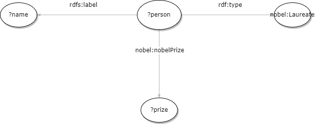
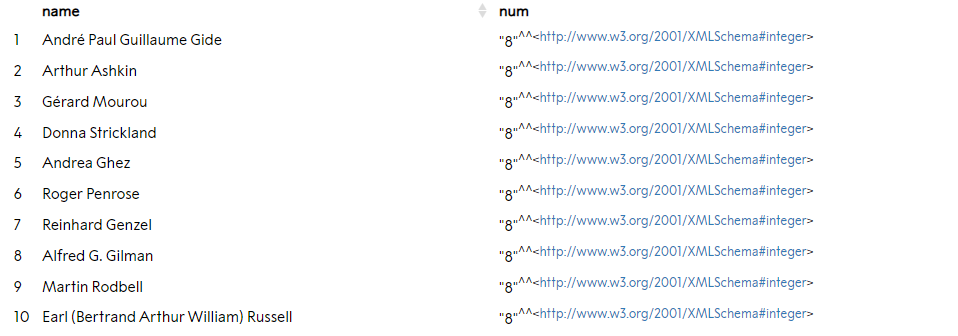
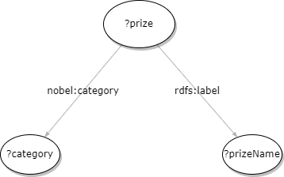
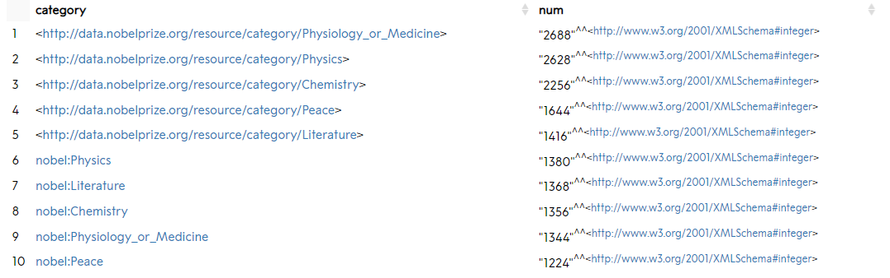

# <center>Rapport du rendu TP</center>

Réalisé par : **Imad Atraoui**

J'ai utilisé le client SPARQL suivant : [Client](https://data.nobelprize.org/sparql).

## Requête 1 :
La première requête affiche le nom des 10 personnes qui ont obtenus le nombre le plus grand des prix nobel. 

Voila le dessin RDF de cette requête :



Le code SPARQL a rejouer sur le client ci dessus est le suivant :
```
PREFIX nobel: <http://data.nobelprize.org/terms/>
PREFIX rdf: <http://www.w3.org/1999/02/22-rdf-syntax-ns#>
PREFIX rdfs: <http://www.w3.org/2000/01/rdf-schema#>

SELECT DISTINCT ?name (COUNT(?prize) AS ?num)
WHERE {
	?person rdf:type nobel:Laureate;
		rdfs:label ?name;
		nobel:nobelPrize ?prize.
}
GROUP BY ?name
ORDER BY ?num
LIMIT 10
```

Les 10 premiers résultats :



## Requête 2 :
La deuxième requête affiche les dix catégories qui ont données le plus de prix noble. 

Voila le dessin RDF de cette requête :



Le code SPARQL a rejouer sur le [Client](https://data.nobelprize.org/sparql)  est le suivant :
```
PREFIX nobel: <http://data.nobelprize.org/terms/>
PREFIX rdf: <http://www.w3.org/1999/02/22-rdf-syntax-ns#>
PREFIX rdfs: <http://www.w3.org/2000/01/rdf-schema#>

SELECT DISTINCT ?category (COUNT(?prize) AS ?num)
WHERE {
	?prize rdfs:label ?prizeName;
        nobel:category ?category.
}
GROUP BY ?category
ORDER BY DESC(?num)
LIMIT 10
```

Les 10 premiers résultats :


